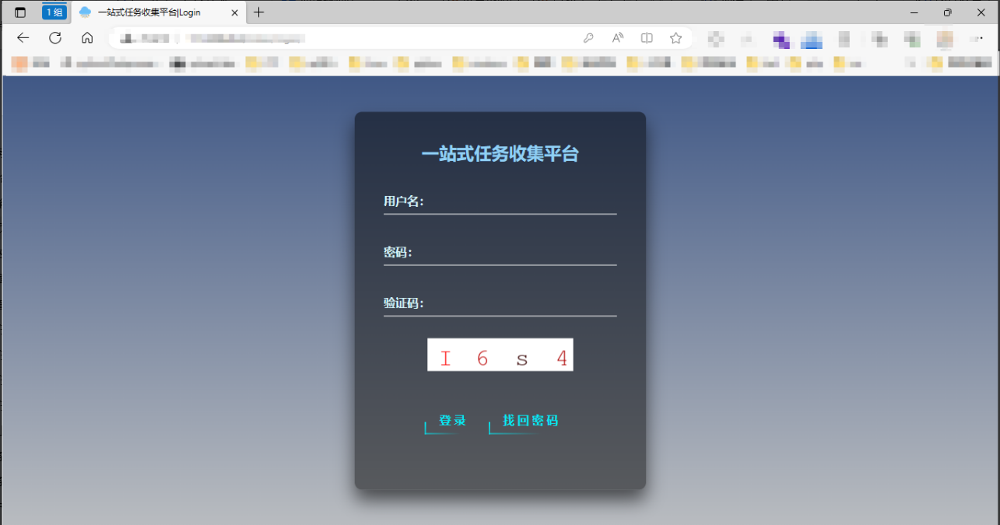
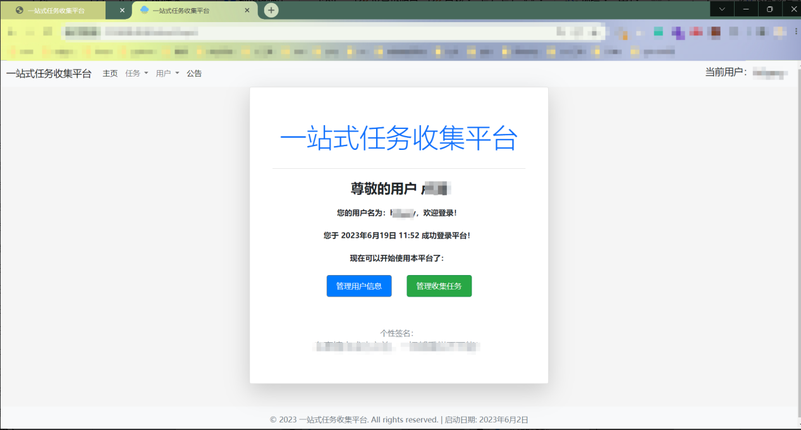
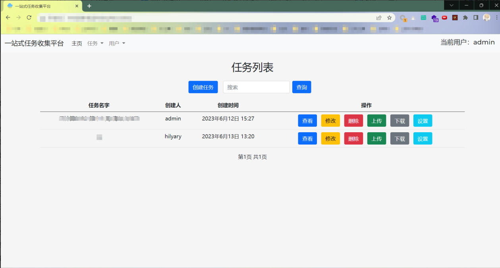
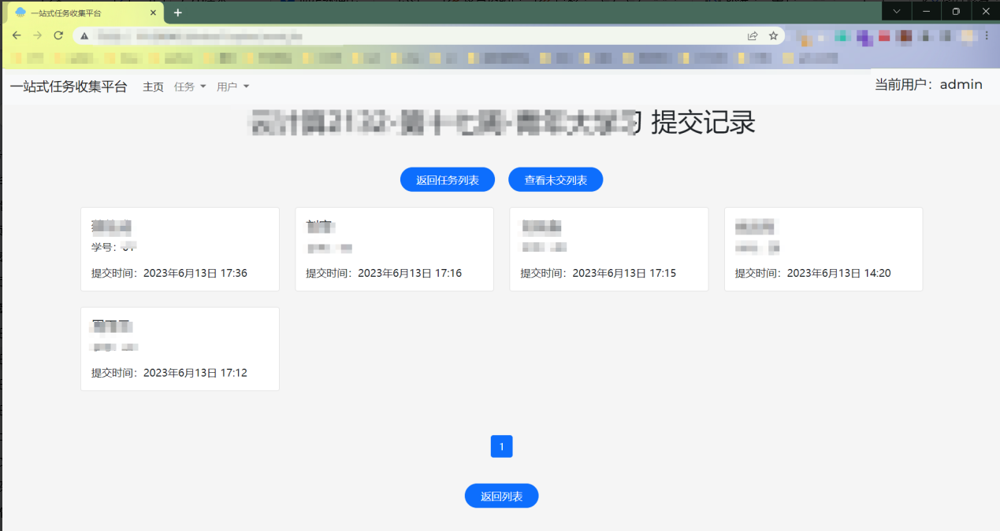
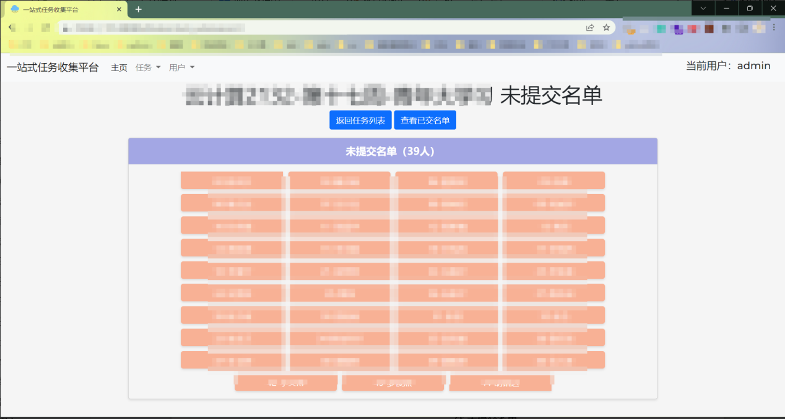
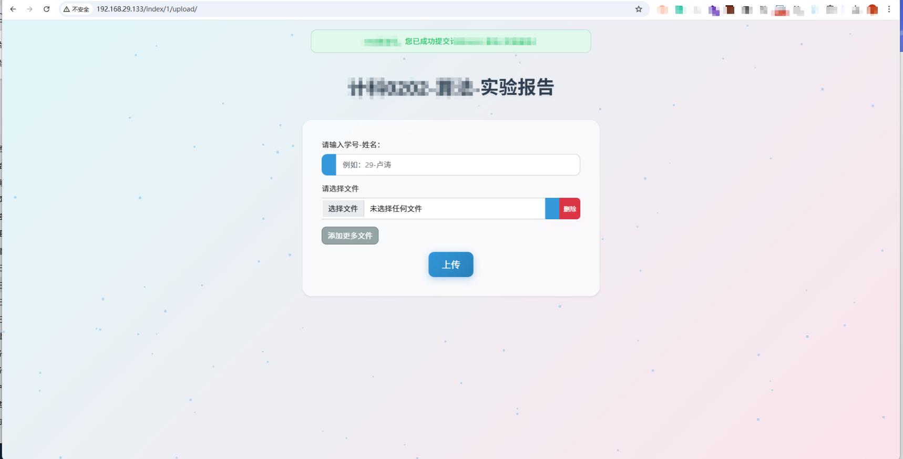
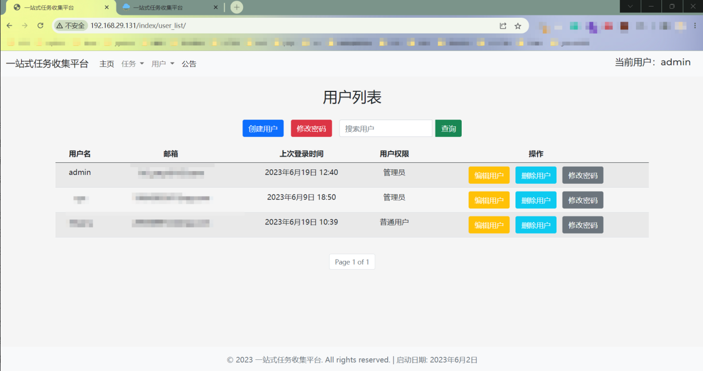

# 📚 一站式任务收集平台


## 🌟 项目简介

一站式任务收集平台是一个基于 Django 2.1 开发的Web应用，专门用于收集各类任务文件，如图片、文档等。平台提供完整的用户管理和任务管理功能，支持权限分级、文件批量下载、实时公告等特性。

## 🐟 项目展示















### ✨ 核心特性

- 🔐 **用户权限管理** - 支持管理员和普通用户两种权限等级
- 📋 **任务管理** - 创建、查看、编辑、删除任务，自动生成存储目录
- 📁 **文件收集** - 支持多种文件格式上传，自动分类存储
- 📦 **批量下载** - 一键打包下载任务相关文件
- 🔍 **搜索功能** - 支持任务名称和创建人搜索
- 📢 **公告系统** - 富文本编辑器支持的公告发布功能
- 📊 **提交统计** - 实时查看提交情况和未提交名单
- 🔒 **安全验证** - 验证码、邮箱找回密码等安全机制
- 📈 **访问日志** - 详细的访问记录和日志管理

## 🏗️ 技术栈

- **后端框架**: Django 2.1
- **数据库**: MariaDB
- **前端**: HTML5 + Bootstrap 5.0.1 + JavaScript
- **Python版本**: 3.6+
- **其他依赖**:
  - django-simple-captcha (验证码)
  - django-tinymce (富文本编辑器)
  - Pillow (图像处理)
  - mysqlclient (数据库连接)

## 🚀 快速开始

### 🎯 一键安装 (强烈推荐)

本项目提供了完整的一键安装脚本，适用于 **CentOS 7** 系统：

```bash
# 0. （可选）配置阿里云镜像源，提升下载速度
# 如果你已经配置过镜像源，可以跳过此步骤
wget -O /etc/yum.repos.d/CentOS-Base.repo https://mirrors.aliyun.com/repo/Centos-7.repo
yum clean all && yum makecache

# 1. 获取项目源码
git clone https://github.com/hilyary/homework.git
cd homework

# 2. 运行一键安装脚本
bash install.sh

# 3. 启动服务
bash start.sh
```

**安装脚本将自动完成：**

- ✅ MariaDB 数据库安装与配置
- ✅ Python3 和 Django 环境搭建
- ✅ 所有依赖包安装
- ✅ 数据库创建和迁移
- ✅ 防火墙端口开放
- ✅ 管理员账户创建 (`admin/homework@admin123`)
- ✅ 静态资源收集

### 🎬 启动服务

安装完成后，使用启动脚本：

```bash
# 前台运行 (用于调试)
bash start.sh

# 后台运行 (生产环境推荐)
nohup bash start.sh &
```

### 📱 访问系统

安装完成后，在浏览器访问：

- **访问地址**: `http://你的服务器IP`
- **默认管理员**: `admin`
- **默认密码**: `homework@admin123`

## 📖 详细功能说明

### 1. 登录系统

**登录页面**：

- 项目根URL自动重定向到登录页面
- 登录表单包含用户名、密码、验证码三个字段
- 用户注册功能已关闭，需由管理员在后台创建用户
- 提供完整的错误提示机制（验证码错误、登录失败等）

**找回密码功能**：

- 在登录页面提供"找回密码"链接
- 支持通过邮箱找回密码
- 系统会验证邮箱是否存在于数据库中
- 发送包含重置链接的邮件
- 重置链接有时效性，过期后显示"链接失效"
- 支持新密码确认验证

### 2. 用户管理

**用户权限体系**：

**管理员权限**：

- 查看和管理所有用户
- 创建新用户
- 修改其他用户密码
- 编辑用户资料
- 删除用户（不能删除自己）
- 管理所有任务

**普通用户权限**：

- 只能查看自己的信息
- 修改自己的密码和资料
- 管理自己创建的任务

**用户管理功能**：

- 用户列表支持分页显示
- 支持按用户名搜索
- 显示用户最新登录时间和权限等级
- 完整的权限验证机制，防止越权操作

### 3. 任务管理

**任务创建**：

- 管理员可创建任务供所有用户使用
- 普通用户只能创建和管理自己的任务
- 创建任务时自动生成同名存储目录
- 任务名称不能重复

**任务查看**：

- 显示任务的所有提交记录
- 提交信息包括学号、姓名、提交时间
- 学号和姓名从上传文件名中自动提取
- 支持分页浏览提交记录
- 提供"未提交名单"功能（需要设置匹配项）

**任务修改**：

- 支持修改任务名称
- 修改后存储目录名也会同步更新
- 目录下的文件不会丢失

**任务删除**：

- 删除任务前会弹出确认对话框
- 删除任务的同时删除对应的存储目录

### 4. 文件上传和下载

**文件上传功能**：

- 任何人都可以通过上传链接提交文件（无需登录）
- 文件命名必须遵循格式：`学号后两位-姓名.扩展名`（如：01-张三.docx）
- 不符合格式的文件会显示错误提示
- 支持多种文件格式

**文件下载功能**：

- 支持一键打包下载任务的所有文件
- 打包格式为ZIP压缩包
- 压缩包以任务名命名

### 5. 匹配项功能

**提交验证机制**：

- 可为每个任务设置学号-姓名匹配项
- 上传时会验证提交者信息是否在匹配项列表中
- 只有匹配成功才能上传文件
- 支持一键复制其他任务的匹配项
- 支持一键删除当前任务的匹配项

### 6. 搜索功能

**任务搜索**：

- 支持按任务名称搜索
- 支持按创建人搜索
- 采用模糊匹配规则
- 搜索框为空时显示所有有权限查看的任务

### 7. 公告系统

**公告管理**（仅管理员）：

- 发布公告（支持富文本编辑器）
- 编辑现有公告
- 删除公告
- 公告置顶功能

**公告查看**（所有用户）：

- 在主页查看最新公告
- 支持查看历史公告

### 8. 系统安全

**访问日志**：

- 记录所有访问请求（包括200、302、404等状态码）
- 按天生成日志文件
- 自动清理，最多保留15天的日志
- 日志存储在项目的logs目录下

**安全机制**：

- 登录验证码防止暴力破解
- 会话管理和权限验证
- 密码修改后强制重新登录
- 完整的越权检查

### 9. 后台管理面板

**主面板**：

- 显示当前登录用户信息
- 提供快速导航到各功能模块
- 显示用户权限等级

**分页功能**：

- 用户列表和任务列表都支持分页
- 每页显示6条记录
- 提供页面跳转功能

## ⚙️ 配置说明

### 📧 邮箱配置 (找回密码功能)

如需使用找回密码功能，需要配置邮箱。编辑 `web/homework/homework/settings.py` 文件：

```python
# 邮件配置（推荐使用163邮箱）
EMAIL_HOST = 'smtp.163.com'  # SMTP服务器地址
EMAIL_HOST_USER = '您的163邮箱地址'  # 发送邮件的邮箱
EMAIL_HOST_PASSWORD = '您的SMTP授权码'  # 邮箱SMTP授权码(非登录密码)
DEFAULT_FROM_EMAIL = '您的163邮箱地址'  # 默认发件人
```

**获取163邮箱SMTP授权码：**

1. 登录163邮箱
2. 设置 → POP3/SMTP/IMAP
3. 开启"客户端授权密码"
4. 获取授权码用于上述配置

### 📁 文件存储配置

- **上传文件存储**: `uploads/` 目录（项目根目录下）
- **访问日志**: `logs/` 目录，按日期自动分割，保留15天
- **静态资源**: `static/` 目录

### 🗄️ 数据库配置

默认数据库配置（在install.sh中设置）：

- **数据库名**: homework
- **用户名**: root
- **密码**: hil@12345
- **字符集**: UTF-8

## 🔧 手动安装 (高级用户)

如果你需要自定义安装过程或了解详细步骤，可以参考以下手动安装流程：

### 1. 📋 系统环境要求

- **操作系统**: CentOS 7 (推荐)
- **Python版本**: 3.6+
- **数据库**: MariaDB 10.0+
- **内存**: 建议 1GB+
- **存储空间**: 建议 10GB+

### 2. 🗄️ 安装MariaDB数据库

```bash
# 1. 安装MariaDB服务
yum -y install mariadb-server

# 2. 启动服务并设置开机自启
systemctl start mariadb
systemctl enable mariadb

# 3. 设置数据库密码
mysqladmin -u root password 'hil@12345'

# 4. 创建项目数据库
mysql -u root -p
# 在MySQL命令行中执行：
create database homework;
use homework;
alter database homework character set utf8;
grant all privileges on homework.* to 'root'@'127.0.0.1' identified by 'hil@12345';
exit
```

### 3. 🐍 Django环境准备

```bash
# 1. 安装Python3
yum -y install python3

# 2. 安装Django 2.1（使用清华镜像源）
pip3 install -i https://pypi.tuna.tsinghua.edu.cn/simple django==2.1

# 3. 安装MySQL客户端和开发包
yum -y install mysql-devel
yum -y install python36-devel
yum -y install gcc
pip3 install mysqlclient

# 4. 升级pip3
pip3 install --upgrade pip

# 5. 安装验证码图像库
pip3 install Pillow
pip3 install django-simple-captcha

# 6. 安装富文本编辑器
pip3 install -i https://pypi.tuna.tsinghua.edu.cn/simple django-tinymce
```

### 4. 🔥 配置防火墙

```bash
# 1. 放开80端口（Web服务）
firewall-cmd --zone=public --add-port=80/tcp --permanent

# 2. 放开3306端口（数据库）
firewall-cmd --zone=public --add-port=3306/tcp --permanent

# 3. 重新加载防火墙规则
firewall-cmd --reload
```

### 5. 📁 获取项目源码

```bash
# 获取项目代码
git clone https://github.com/hilyary/homework.git
cd homework
```

### 6. ⚙️ 项目配置

```bash
# 1. 进入Django项目目录
cd web/homework/

# 2. 编辑配置文件
vim homework/settings.py
```

**需要配置的关键项目：**

```python
# 数据库配置（已默认配置）
DATABASES = {
    'default': {
        'ENGINE': 'django.db.backends.mysql',
        'NAME': 'homework',
        'USER': 'root',
        'PASSWORD': 'hil@12345',
        'HOST': '127.0.0.1',
        'PORT': '3306',
    }
}

# 邮箱配置（用于找回密码功能）
EMAIL_HOST = 'smtp.163.com'
EMAIL_HOST_USER = '您的163邮箱地址'
EMAIL_HOST_PASSWORD = '您的SMTP授权码'  # 注意：不是登录密码
DEFAULT_FROM_EMAIL = '您的163邮箱地址'
```

### 7. 🏗️ 初始化项目

```bash
# 确保在 web/homework/ 目录下执行以下命令

# 1. 确认必要目录存在（通常已存在）
mkdir -p ../../uploads  # 文件上传目录
mkdir -p ../../logs     # 访问日志目录

# 2. 数据库迁移
python3 manage.py makemigrations
python3 manage.py migrate

# 3. 收集静态资源
python3 manage.py collectstatic

# 4. 创建管理员账户
python3 manage.py createsuperuser
# 按提示输入用户名、邮箱和密码
```

### 8. 🚀 启动项目

```bash
# 在 web/homework/ 目录下启动
python3 manage.py runserver 0.0.0.0:80
```

### 9. 🌐 访问测试

在浏览器中访问：`http://你的服务器IP`

### 10. 📝 后续维护

每次更新静态资源（CSS、JS、图片等）后需要重新收集：

```bash
python3 manage.py collectstatic
```

### 🔍 手动安装验证

完成手动安装后，可以通过以下命令验证安装状态：

```bash
# 检查服务运行状态
systemctl status mariadb    # 数据库服务
netstat -tlnp | grep :80    # Web服务端口

# 检查目录结构
ls -la uploads/             # 文件上传目录
ls -la logs/                # 日志目录

# 测试数据库连接
mysql -u root -phil@12345 -e "SHOW DATABASES;"

# 检查Python依赖
pip3 list | grep -E "(Django|mysqlclient|Pillow|captcha|tinymce)"
```

### 🔥 CentOS 7 镜像源优化

为了提升安装速度，建议配置阿里云镜像源：

```bash
# 备份原镜像源
mv /etc/yum.repos.d/CentOS-Base.repo /etc/yum.repos.d/CentOS-Base.repo.backup

# 下载阿里云镜像源
wget -O /etc/yum.repos.d/CentOS-Base.repo https://mirrors.aliyun.com/repo/Centos-7.repo

# 清理缓存并重建
yum clean all && yum makecache
```

## 👥 用户权限详解

### 管理员权限

- ✅ 创建、编辑、删除用户
- ✅ 管理所有任务
- ✅ 发布和管理公告
- ✅ 修改其他用户密码
- ✅ 查看系统统计信息
- ✅ 设置任务匹配项

### 普通用户权限

- ✅ 管理自己创建的任务
- ✅ 上传和下载文件
- ✅ 修改个人资料和密码
- ✅ 查看公告
- ❌ 无法管理其他用户
- ❌ 无法发布公告

## 📝 使用指南

### 创建和管理任务

1. **创建任务**：
   
   - 登录系统后点击"创建任务"
   - 输入任务名称（系统会检查重复性）
   - 系统自动创建对应的文件存储目录

2. **文件收集**：
   
   - 在任务列表中点击"上传"按钮获取上传链接
   - 分享链接给需要提交文件的人员
   - 访问者无需登录即可上传文件
   - 文件必须按照格式命名：`学号后两位-姓名.扩展名`

3. **查看提交**：
   
   - 点击"查看"按钮查看提交记录
   - 可查看已提交和未提交名单
   - 支持批量打包下载所有文件

4. **设置匹配项**：
   
   - 为任务设置学号-姓名匹配列表
   - 只有在匹配列表中的用户才能上传文件
   - 支持从其他任务复制匹配项

### 用户管理操作

1. **创建用户**（仅管理员）：
   
   - 点击"创建用户"按钮
   - 填写用户名、邮箱、密码等信息
   - 设置用户权限等级

2. **修改密码**：
   
   - 用户可以修改自己的密码
   - 管理员可以修改任何用户的密码
   - 密码修改后需要重新登录

3. **编辑资料**：
   
   - 修改邮箱、真实姓名等信息
   - 管理员可以编辑任何用户的资料

## 🔧 故障排除

### ❓ 常见问题

**Q: 执行install.sh提示权限不足**

```bash
# 解决方案：使用root权限执行
sudo bash install.sh
# 或切换到root用户
su -
bash install.sh
```

**Q: 安装过程中提示"No package python3 available"**

```bash
# 解决方案：更新yum源或启用EPEL仓库
yum update -y
yum install -y epel-release
```

**Q: MariaDB启动失败**

```bash
# 检查服务状态
systemctl status mariadb
# 查看详细日志
journalctl -u mariadb -f
```

**Q: 防火墙规则不生效**

```bash
# 检查防火墙状态
firewall-cmd --state
# 查看开放的端口
firewall-cmd --list-ports
# 重启防火墙服务
systemctl restart firewalld
```

**Q: 访问网站显示"It worked!"**

```bash
# 确认是否正确启动了Django项目
cd web/homework/
python3 manage.py runserver 0.0.0.0:80
```

**Q: 上传文件提示格式错误**  
A: 确保文件命名格式为 `学号后两位-姓名.扩展名`，例如：`01-张三.docx`

**Q: 邮件发送失败**  
A: 检查163邮箱SMTP配置，确认使用的是授权码而不是登录密码

**Q: 匹配项验证不生效**  
A: 检查任务是否已设置匹配项，上传文件名格式是否正确

**Q: 文件上传后无法下载**  
A: 检查uploads目录权限，确保Web服务有读写权限

### 📋 检查安装状态

```bash
# 检查服务运行状态
systemctl status mariadb    # 数据库服务
netstat -tlnp | grep :80    # Web服务端口

# 检查目录结构
ls -la uploads/             # 文件上传目录
ls -la logs/                # 日志目录

# 测试数据库连接
mysql -u root -phil@12345 -e "SHOW DATABASES;"
```

### 🔄 重新安装

如果安装过程出现问题，可以执行以下命令重置：

```bash
# 停止相关服务
systemctl stop mariadb

# 清理数据库 (谨慎操作)
rm -rf /var/lib/mysql/homework

# 重新执行安装脚本
bash install.sh
```

## 🎯 使用场景

### 适用场景

- **教育机构**：收集学生作业、实验报告
- **企业培训**：收集员工培训材料、考核文件
- **活动组织**：收集参赛作品、报名材料
- **项目管理**：收集项目文档、进度报告
- **调研活动**：收集问卷、统计资料

### 优势特点

- **零门槛提交**：提交者无需注册登录
- **智能验证**：通过匹配项确保提交者身份
- **批量处理**：支持一键打包下载所有文件
- **权限分级**：管理员和普通用户权限清晰
- **访问追踪**：完整的访问日志记录

## 🛡️ 安全说明

### 安全特性

- **登录保护**：验证码防止暴力破解
- **权限验证**：每个操作都有严格的权限检查
- **会话管理**：密码修改后强制重新登录
- **访问日志**：记录所有访问行为
- **文件验证**：上传文件格式和命名验证

### 安全建议

- 定期更改管理员密码
- 配置强密码策略
- 定期检查访问日志
- 及时更新系统补丁
- 定期备份数据库

## 🚀 性能优化

### 推荐配置

- **生产环境**：至少2GB内存，建议4GB+
- **存储空间**：根据文件收集量预估，建议50GB+
- **网络带宽**：根据并发用户数配置

### 优化建议

- 使用Nginx作为反向代理
- 配置静态文件CDN
- 定期清理过期文件
- 数据库索引优化

## 🤝 贡献指南

欢迎提交 Issue 和 Pull Request！

### 贡献流程

1. Fork 本仓库
2. 创建特性分支 (`git checkout -b feature/AmazingFeature`)
3. 提交更改 (`git commit -m 'Add some AmazingFeature'`)
4. 推送到分支 (`git push origin feature/AmazingFeature`)
5. 开启 Pull Request

### 开发规范

- 遵循PEP8代码规范
- 添加适当的注释和文档
- 提交前进行充分测试
- 保持向后兼容性

## 📄 开源协议

本项目基于 **GNU Affero General Public License v3.0 (AGPL-3.0)** 开源协议发布。  
详情请参阅 [LICENSE](./LICENSE) 文件。

### 协议要点

- ✅ 商业使用
- ✅ 修改分发
- ✅ 专利使用
- ❗ 网络使用需开源
- ❗ 相同协议分发
- ❗ 保留版权信息

## 🔮 未来计划

### 待开发功能

- [ ] 移动端响应式优化
- [ ] 文件在线预览功能
- [ ] 批量用户导入导出
- [ ] 更多文件格式支持
- [ ] API接口开放
- [ ] 多语言支持

### 版本规划

- **v1.1**：移动端优化、文件预览
- **v1.2**：API接口、批量操作增强
- **v2.0**：微服务架构重构

## 🙏 致谢

感谢所有为这个项目贡献代码的开发者！

### 特别感谢

- Django社区提供的优秀框架
- Bootstrap团队的前端组件库
- TinyMCE富文本编辑器
- 所有测试用户的宝贵反馈

## 📞 联系方式

- **项目主页**：[GitHub - hilyary/homework: 一站式任务收集平台](https://github.com/hilyary/homework)
- **问题反馈**：https://github.com/hilyary/homework/issues
- **博客**：https://hilyary.github.io

### 支持渠道

- GitHub Issues：技术问题和Bug报告
- 邮件联系：功能建议和合作咨询

---

⭐ 如果这个项目对你有帮助，请给个Star支持一下！

🎉 欢迎Fork和贡献代码，让我们一起完善这个项目！
